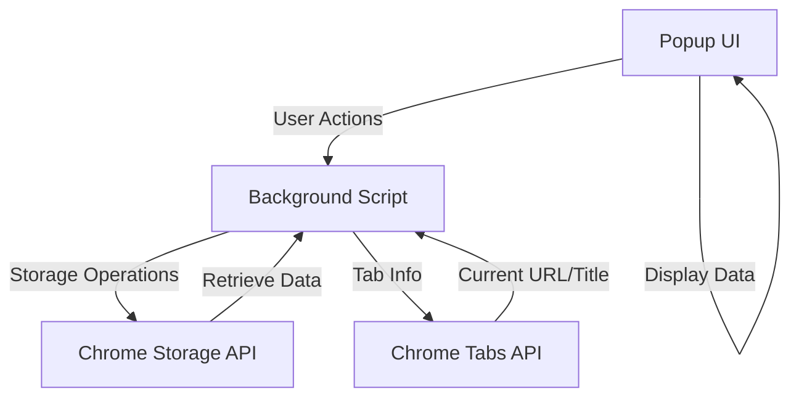
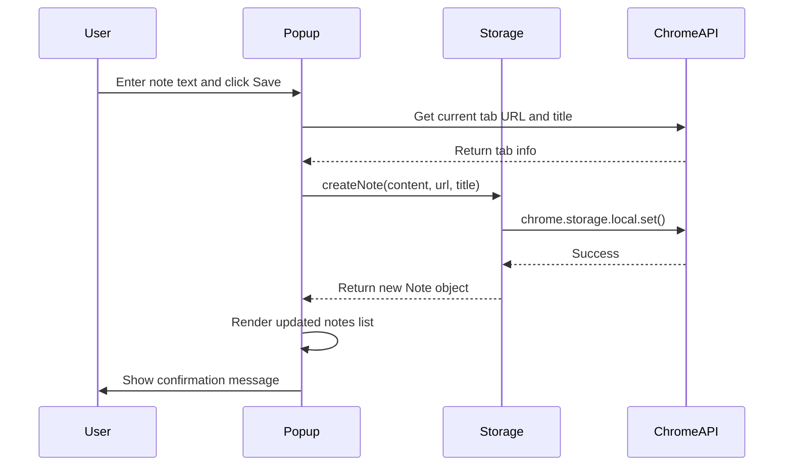
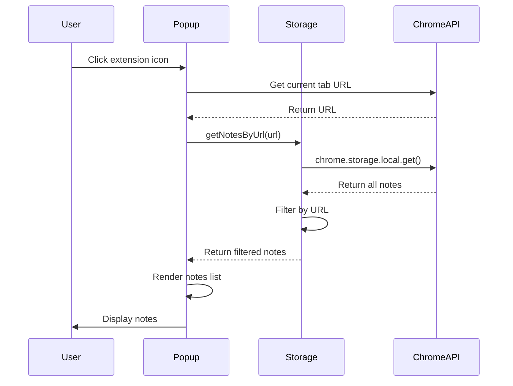

# Design Document: Web Notes Chrome Extension

## Overview

The Web Notes Chrome Extension is a browser extension that enables users to capture, manage, and search notes associated with specific webpages. The extension uses a popup-based UI that appears when the user clicks the extension icon, displaying notes relevant to the current webpage. All data is stored locally using Chrome's Storage API, ensuring privacy and offline access.

## Architecture

The extension follows the standard Chrome Extension architecture with three main components:



### Component Breakdown

1. **Popup UI (popup.html/popup.js)**: The user-facing interface for creating, viewing, editing, and deleting notes
2. **Background Script (background.js)**: Manages extension lifecycle and coordinates between UI and storage
3. **Storage Layer**: Utilizes Chrome's local storage API for persistent data
4. **Manifest (manifest.json)**: Defines extension configuration, permissions, and entry points

## Components and Interfaces

### 1. Manifest Configuration

The manifest.json file defines the extension structure:

```json
{
  "manifest_version": 3,
  "name": "Web Notes",
  "version": "1.0.0",
  "permissions": ["storage", "tabs", "activeTab"],
  "action": {
    "default_popup": "popup.html",
    "default_icon": "icon.png"
  }
}
```

**Key Permissions:**
- `storage`: Access to Chrome's local storage API
- `tabs`: Read tab information (URL, title)
- `activeTab`: Access current tab details when popup is opened

### 2. Data Models

#### Note Object

```typescript
interface Note {
  id: string;              // Unique identifier (UUID)
  content: string;         // Note text content
  url: string;             // Associated webpage URL
  pageTitle: string;       // Associated webpage title
  createdAt: number;       // Unix timestamp (milliseconds)
  updatedAt: number;       // Unix timestamp (milliseconds)
}
```

#### Storage Structure

Notes are stored in Chrome's local storage with the following structure:

```typescript
{
  "notes": {
    [noteId: string]: Note
  }
}
```

**Design Decision:** Using a flat object structure with note IDs as keys allows for O(1) lookups and efficient updates/deletes.

### 3. Popup UI Component

**File:** popup.html, popup.js, popup.css

The popup UI consists of:

- **Header Section**: Extension title and search input
- **Note Input Section**: Textarea for creating new notes with a save button
- **Notes List Section**: Scrollable list of existing notes for the current page
- **Note Item**: Individual note display with edit/delete buttons

**UI Flow:**
1. User clicks extension icon → Popup opens
2. Popup loads current tab URL and title
3. Popup retrieves and displays notes for current URL
4. User can create, edit, delete, or search notes

### 4. Storage Service

**Responsibilities:**
- CRUD operations for notes
- Querying notes by URL
- Search functionality across all notes

**Key Methods:**
```typescript
class StorageService {
  async createNote(content: string, url: string, pageTitle: string): Promise<Note>
  async getNotesByUrl(url: string): Promise<Note[]>
  async updateNote(id: string, content: string): Promise<Note>
  async deleteNote(id: string): Promise<void>
  async searchNotes(query: string, url: string): Promise<Note[]>
}
```

### 5. UI Controller

**Responsibilities:**
- Handle user interactions
- Update DOM based on data changes
- Coordinate between UI and storage service

**Key Methods:**
```typescript
class UIController {
  async initialize(): Promise<void>
  async loadNotesForCurrentPage(): Promise<void>
  async handleCreateNote(): Promise<void>
  async handleEditNote(noteId: string): Promise<void>
  async handleDeleteNote(noteId: string): Promise<void>
  async handleSearch(query: string): Promise<void>
  renderNotes(notes: Note[]): void
}
```

## Data Flow

### Creating a Note



### Loading Notes



## Error Handling

### Storage Errors

**Scenario:** Chrome Storage API operations fail
- **Detection:** Catch errors from chrome.storage.local operations
- **Response:** Display user-friendly error message in popup
- **Recovery:** Allow user to retry operation

**Example:**
```typescript
try {
  await chrome.storage.local.set({ notes: updatedNotes });
} catch (error) {
  displayError("Failed to save note. Please try again.");
  console.error("Storage error:", error);
}
```

### Tab Access Errors

**Scenario:** Unable to retrieve current tab information
- **Detection:** Check chrome.tabs.query result
- **Response:** Display error message indicating extension cannot access tab
- **Recovery:** Prompt user to refresh page or reopen popup

### Data Integrity

**Scenario:** Corrupted or invalid data in storage
- **Detection:** Validate note objects when retrieving from storage
- **Response:** Filter out invalid notes and log warnings
- **Recovery:** Continue with valid notes, allow user to create new notes

## Testing Strategy

### Unit Tests

**Storage Service Tests:**
- Test CRUD operations for notes
- Test filtering notes by URL
- Test search functionality with various queries
- Test handling of empty storage
- Test data validation

**UI Controller Tests:**
- Test note rendering with various data sets
- Test user interaction handlers
- Test search input debouncing
- Test error message display

### Integration Tests

- Test complete flow: create → save → retrieve → display
- Test edit flow: edit → save → verify update
- Test delete flow: delete → confirm → verify removal
- Test search flow: enter query → filter → display results
- Test popup initialization with existing notes

### Manual Testing Scenarios

1. **First-time user**: Install extension, create first note, verify storage
2. **Multiple pages**: Create notes on different pages, verify isolation
3. **Edit and delete**: Modify existing notes, delete notes, verify persistence
4. **Search**: Search across notes, verify case-insensitive matching
5. **Browser restart**: Close browser, reopen, verify notes persist
6. **Performance**: Create 100+ notes, verify UI responsiveness

## Performance Considerations

### Storage Optimization

- Use indexed structure (object with ID keys) for O(1) access
- Limit note content size to prevent storage quota issues
- Consider implementing pagination if note count exceeds 1000

### UI Responsiveness

- Debounce search input (300ms) to reduce filtering operations
- Use virtual scrolling if note list exceeds 50 items
- Minimize DOM manipulations by batching updates

### Memory Management

- Clear event listeners when popup closes
- Avoid storing large objects in memory
- Use efficient data structures for filtering and searching

## Security Considerations

- All data stored locally, no external network requests
- No sensitive permissions requested beyond storage and tabs
- Input sanitization to prevent XSS in note content display
- Use textContent instead of innerHTML for user-generated content

## Future Enhancements

While not part of the initial implementation, these features could be added later:

- Export/import notes as JSON
- Organize notes with tags or categories
- Sync notes across devices (optional cloud storage)
- Rich text formatting support
- Keyboard shortcuts for quick note capture
- Browser history integration to show notes timeline
